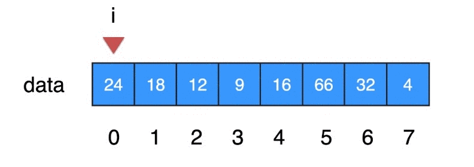

[TOC]

# 1.什么是算法

- 一个非常简单的算法
- 适应更多的数据类型
- 如何编写正确的程序
- 性能测试
- 复杂度分析


Algorithm本意:解决问题的方法


一系列解决问题的的，清晰，可执行的计算机指令11

算法的五大特性
- 1.有限性
- 2.确定性:不会产生二义性
- 3.可行性
- 4.输入
- 5.输出

# 2.最简单的算法:线性查找法

在一沓试卷中，找到属于自己的那张试卷
- 第1张:不是
- 第2张:不是
- 第3张:不是

以此类推


在data数组中查找 16 



输入：数组，和目标元素    
输出：目标元素所在的索引；若不存在，返回-1 

# 3.实现线性查找法


## 1.Linear-Search
### java
private LinearSearch(){}   //阻止用户创建LinearSearch类对象，不加的话，用户使用new LinearSearch();依然可以新建类对象

```
public class LinearSearch {
    private LinearSearch(){} 
    public static int search(int[] data, int target){
        for(int i = 0; i < data.length; i++){
            if(data[i] == target){
                return i;
            }
        }
        return -1;
    }
    public static void main(String[] args){
        int[] data = {24, 18, 12, 9, 16, 66, 32, 4};

        int res = LinearSearch.search(data, 16);
        System.out.println(res);

        int res2 = LinearSearch.search(data, 666);
        System.out.println(res2);
    }
}
```

### C++

```
#include <iostream>

using namespace std;

class LinearSearch
{
public:
    static int search(int *data, int target){
        int len = sizeof(data);
        for(int i = 0; i < len; i++){
            if(data[i] == target){
                return i;
            }
        }
        return -1;
    }
private:
};

int main()
{
    int data[] = {24, 18, 12, 9, 16, 66, 32, 4};

    int res1 = LinearSearch::search(data, 16);
    cout << res1 << endl;

    int res2 = LinearSearch::search(data, 999);
    cout << res2 << endl;
    return 0;
}
```

### python

```
class LinearSearch(object):

    def __init__(self):
        pass

    @staticmethod
    def search(data, target):
        for i in range(len(data)):
            if data[i] == target:
                return i
        return False


if __name__ == "__main__":
    data = [24, 18, 12, 9, 16, 66, 32, 4]

    res1 = LinearSearch.search(data, target=16)
    print(res1)

    res2 = LinearSearch.search(data, target=999)
    print(res2)
```

## 2.Using-Generic

- 不可以是基本数据类型，只能是类对象boolean, byte, char, short, int, long, float, double
- 每个基本数据类型都有对应的包装类Boolean, Byte, Character, Short, Integer, Long, Float, Double

作业：   
自己设计一个Student类，实现equals方法。

### java

```
public class LinearSearch {
    private LinearSearch(){}
    public static <E> int search(E[] data, E target){
        for(int i = 0; i < data.length; i++){
            if(data[i].equals(target)){
                return i;
            }
        }
        return -1;
    }
    public static void main(String[] args){
        Integer[] data = {24, 18, 12, 9, 16, 66, 32, 4};

        int res = LinearSearch.search(data, 16);
        System.out.println(res);

        int res2 = LinearSearch.search(data, 666);
        System.out.println(res2);
    }
}
```


### C++

```
#include <iostream>

using namespace std;

#define length(arr) sizeof(arr)/sizeof(arr[0])

class LinearSearch
{
private:
    LinearSearch() {}
public:
    template<typename T>
    static int search(T *data, T target, int len){
        for(int i = 0; i < len; i++){
            if(data[i] == target){
                return i;
            }
        }
        return -1;
    }
};

int main()
{
    int data[] = {24, 18, 12, 9, 16, 66, 32, 4};

    int res1 = LinearSearch::search(data, 16, sizeof(data)/sizeof(data[0]));
    cout << res1 << endl;

    int res2 = LinearSearch::search(data, 999, sizeof(data)/sizeof(data[0]));
    cout << res2 << endl;
    return 0;
}
```


## 3.Using-Custom-Class


### java

```

```


### C++

```

```


### python
```

```


## 4.Test-Performance


### java

```

```


### C++

```

```


### python
```

```


