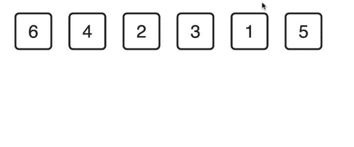
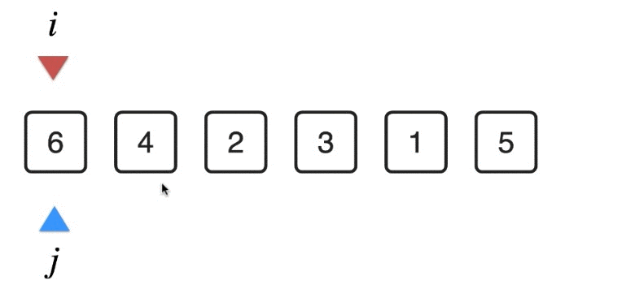

[TOC]

# 1.基础排序算法

排序算法：让数据有序  

排序算法中蕴含着重要的算法设计思想   

选择排序法   

插入排序法   

## 选择排序法

先把最小的拿出来  

剩下的，再把最小的拿出来  

......

每次选择还没处理的元素里最小的元素

排序过程中占用了额外的空间，需要改进到原地完成？ 原地排序    

arr[i...n)未排序   arr[0...i)已排序  循环不变量      
arr[i...n)中的最小值要放到arr[i]的位置    

